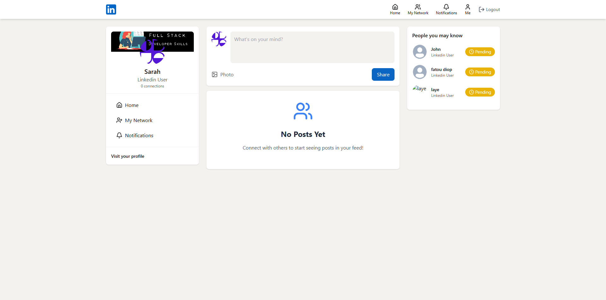
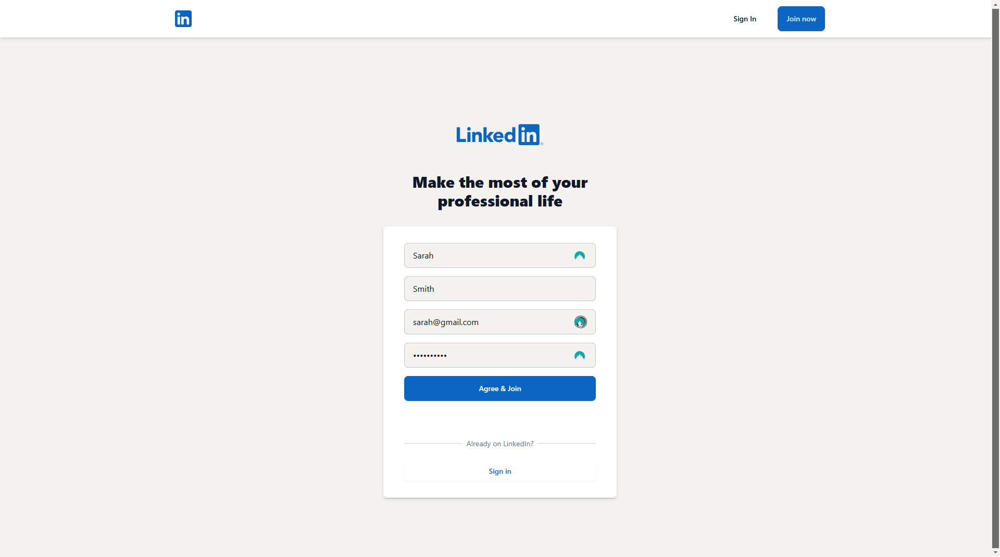
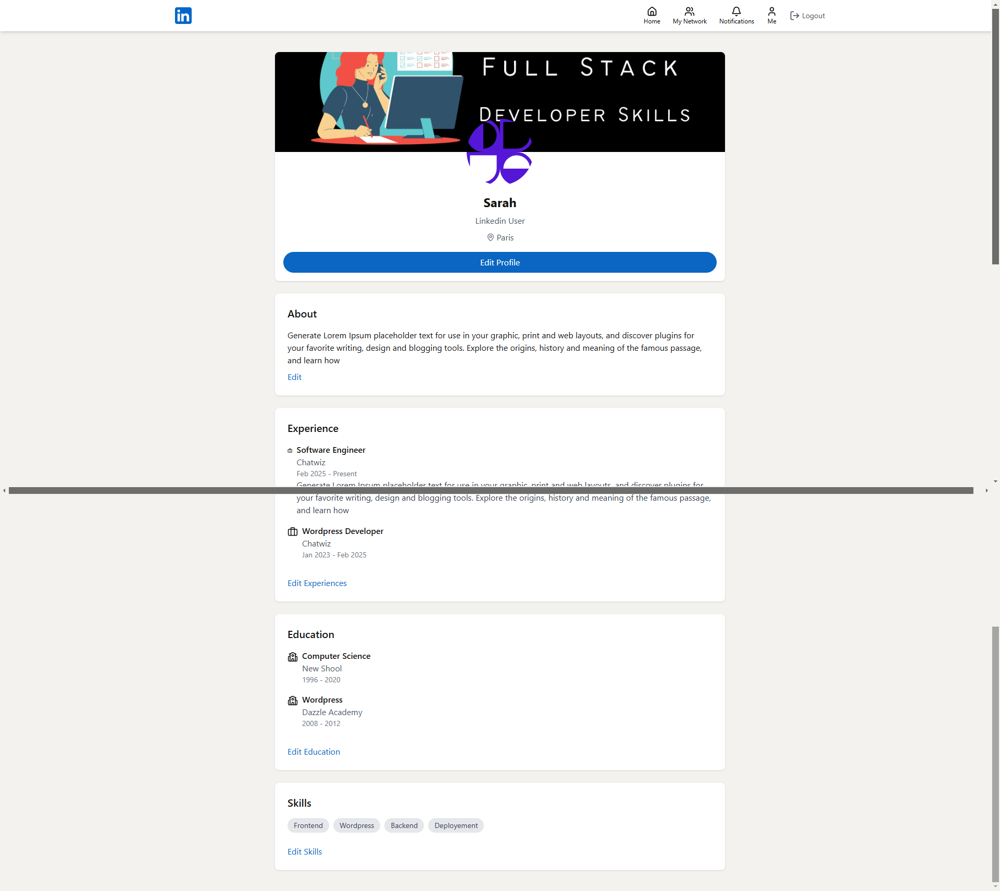
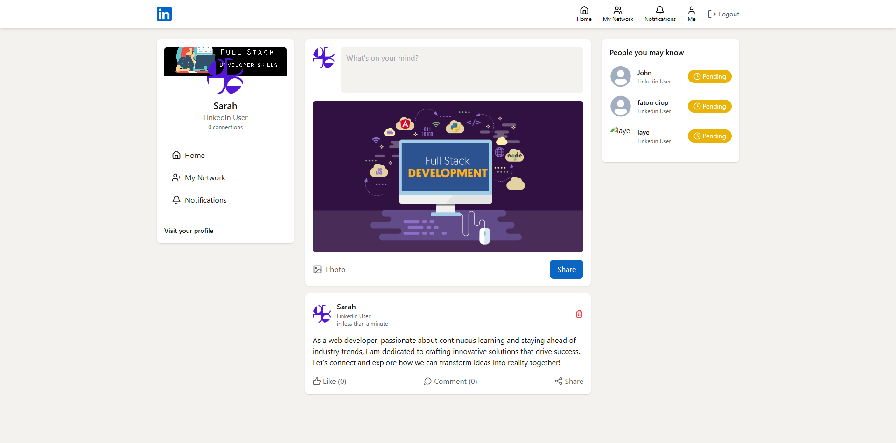

# linkedjob

# LinkedJob

<h1>LinkedIn Clone Project Summary</h1>

This project is about LinkedJob, the ultimate app that connect job seekers and recruiters
This full-stack project guides me through building a LinkedIn clone with the following features:

Project Setup: Initial configuration and environment setup.

MongoDB Integration: Database setup for storing user and post data.

Stripe Payment Setup: Integration with Stripe for payment processing.

Authentication System with JWT: Secure user authentication using JSON Web Tokens.

Data Protection: Ensuring user data security and privacy.

Connection Requests: Features to send, accept, and reject connection requests.

Creating and Sharing Posts: Functionality for users to create and share posts.

Image Upload for Posts and Profiles: Allowing users to upload images for their posts and profiles.

Profile Creation and Updates: User profile management and updates.

Suggested Users Feature: Algorithm to suggest users for connections.

Like and Comment on Posts: Interaction features for liking and commenting on posts.

News Feed Algorithm: Algorithm to display relevant posts in the user's news feed.

This project provides me a comprehensive guide to building a feature-rich social networking platform similar to LinkedIn

<h1></h1>
<h1>HomeScreen</h1>

<h1></h1>

<h2>Authentication: Clerk</h2>

<h1></h1>
<h2>Profile Features: Private chats group chats, post, status</h2>

<h1></h1>
<h2>AI Integration: ChatGPT and DALL-E-3 </h2>

# 💻 Tech Use:

A feature-rich WhatsApp clone built with the following tech stack

        

  

<picture>
  <source media="(prefers-color-scheme: dark)" srcset="https://raw.githubusercontent.com/tobiasmeyhoefer/tobiasmeyhoefer/output/github-snake-dark.svg" />
  <source media="(prefers-color-scheme: light)" srcset="https://raw.githubusercontent.com/tobiasmeyhoefer/tobiasmeyhoefer/output/github-snake.svg" />
  
</picture>
